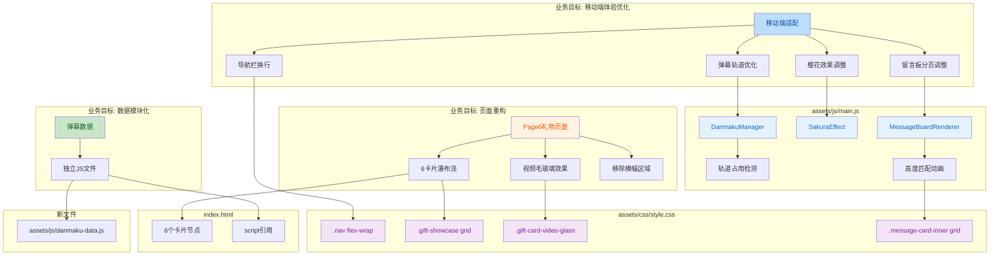

## 1. 高层摘要 (TL;DR)

*   **影响范围:** 🟡 **中** - 涉及UI重构、移动端适配、数据模块化
*   **核心变更:**
    *   📱 全面优化移动端体验（导航栏、弹幕、樱花效果、留言板）
    *   🎁 Page6 礼物页面从3卡片重构为6卡片瀑布流布局
    *   🔧 弹幕数据模块化，移至独立文件
    *   🎴 修复留言板3D翻转动画的高度跳动问题
    *   🐛 修复时间轴图片查看器的点击事件

---

## 2. 可视化概览 (代码与逻辑映射)



---

## 3. 详细变更分析

### 📱 组件一: 移动端适配优化

#### **变更说明**
针对 `window.innerWidth <= 768` 的设备，全面调整了动画参数、布局和交互逻辑。

#### **核心变更点**

| 模块 | 参数 | 桌面端 | 移动端 | 说明 |
|------|------|--------|--------|------|
| **弹幕轨道** | 轨道数量 | 6条 | 3条 | 减少轨道避免拥挤 |
| **弹幕轨道** | 持续时间 | 16-24秒 | 14-20秒 | 延长移动端显示时间 |
| **弹幕播放** | 播放间隔 | 2500ms | 5000ms | 降低频率减少性能压力 |
| **樱花效果** | 生成间隔 | 200ms | 500ms | 降低生成频率 |
| **樱花效果** | 字体大小 | 10-28px | 6-12px | 缩小尺寸适配小屏 |
| **留言板** | 每页条数 | 8条 | 4条 | 减少每页内容 |
| **导航栏** | 布局方式 | 单行滚动 | 多行换行 | 避免内容被裁切 |

#### **代码实现细节**

**弹幕轨道智能分配 (Source: `assets/js/main.js`)**
```javascript
// 新增轨道占用检测机制
findFreeTrack() {
  const start = this.nextTrack;
  for (let i = 0; i < this.trackCount; i++) {
    const track = (start + i) % this.trackCount;
    if (!this.trackOccupied[track]) {
      this.nextTrack = (track + 1) % this.trackCount;
      return track;
    }
  }
  return -1; // 所有轨道占用
}
```

**导航栏响应式布局 (Source: `assets/css/style.css`)**
```css
/* 移动端导航栏从横向滚动改为换行布局 */
.nav {
  flex-wrap: wrap;
  white-space: normal;
  height: auto;
  padding: 8px 14px;
  gap: 4px 8px;
  row-gap: 6px;
  justify-content: center;
}
```

---

### 🎁 组件二: Page6 礼物页面重构

#### **变更说明**
将原来的"主横幅 + 3卡片"布局重构为"标题 + 6卡片瀑布流"布局，新增视频卡片毛玻璃效果。

#### **布局对比**

| 特性 | 旧布局 | 新布局 |
|------|--------|--------|
| **顶部区域** | gift-hero横幅 (带胶带装饰) | 简洁标题 + 副标题 |
| **卡片数量** | 3个 (图片-视频-预留) | 6个 (4图片 + 2视频) |
| **网格列数** | 1fr 1.4fr 1fr | 1fr 1fr 1fr |
| **卡片倾斜** | 首尾卡片 ±0.6deg | 全部 0deg |
| **视频样式** | 独立video-type | video-glass毛玻璃效果 |

#### **新增样式类**

| 类名 | 用途 |
|------|------|
| `.gift-card-video-glass` | 视频卡片毛玻璃容器 |
| `.image-horizontal` | 4:3横版图片 |
| `.video-play-overlay` | 视频播放按钮覆盖层 |
| `.page-title-note` | 页面标题副文本 |
| `.gift-divider-author` | 分割线作者信息 |

#### **HTML结构变更 (Source: `index.html`)**
```html
<!-- 旧结构 -->
<div class="gift-hero">
  <div class="hero-tape"></div>
  <div class="gift-hero-content">
    <h2>特殊贈り物</h2>
  </div>
</div>
<div class="gift-showcase">
  <!-- 3个卡片 -->
</div>

<!-- 新结构 -->
<h2 class="page-title">ファン×デジタルギフト · Fan x Digital Gift</h2>
<p class="page-title-note">— 献给猫羽おかゆ —</p>
<div class="gift-showcase">
  <!-- 6个卡片: 4个图片 + 2个视频 -->
</div>
```

---

### 🎴 组件三: 留言板3D翻转修复

#### **问题说明**
原实现使用 `absolute` 定位，翻转时卡片高度会因内容差异跳动，导致动画不流畅。

#### **解决方案**
使用 CSS Grid 将正反面重叠，并在翻转前动态计算目标面高度。

#### **技术实现 (Source: `assets/js/main.js`)**

```javascript
// 高度匹配函数
matchCardHeight(card, inner, toBack) {
  const targetFace = toBack
    ? inner.querySelector('.message-card-back')
    : inner.querySelector('.message-card-front');
  const temp = targetFace.cloneNode(true);
  temp.style.position = 'absolute';
  temp.style.visibility = 'hidden';
  temp.style.width = card.clientWidth + 'px';
  temp.style.backfaceVisibility = 'visible';
  temp.style.transform = 'none';
  document.body.appendChild(temp);
  const height = temp.offsetHeight;
  document.body.removeChild(temp);
  card.style.transition = 'height 0.3s ease';
  card.style.height = height + 'px';
}

// 翻转事件处理
card.addEventListener('click', () => {
  if (inner.classList.contains('flipping')) return;
  inner.classList.add('flipping');
  this.matchCardHeight(card, inner, !inner.classList.contains('flipped'));
  setTimeout(() => {
    inner.classList.toggle('flipped');
    this.releaseCardHeight(card, inner);
    inner.classList.remove('flipping');
  }, 50);
});
```

#### **CSS变更 (Source: `assets/css/style.css`)**
```css
/* 从 absolute 改为 grid 重叠 */
.message-card-inner {
  display: grid;  /* 新增 */
  /* position: relative;  移除 */
  /* padding: 20px 22px;  移除 */
}

.message-card-front,
.message-card-back {
  grid-area: 1 / 1;  /* 新增: 重叠在同一网格 */
  padding: 20px 22px;  /* 从 inner 移到这里 */
}

.message-card-back {
  /* position: absolute;  移除 */
  /* top/left/width/height 移除 */
  transform: rotateY(180deg);
}
```

---

### 📦 组件四: 数据模块化

#### **变更说明**
将硬编码在 `main.js` 中的弹幕数据提取到独立文件 `danmaku-data.js`，便于维护和扩展。

#### **文件变更**

| 文件 | 操作 | 说明 |
|------|------|------|
| `assets/js/danmaku-data.js` | ✨ 新增 | 包含54条粉丝弹幕数据 |
| `assets/js/main.js` | 🗑️ 删除 | 移除硬编码的 `sampleDanmaku` 数组 |
| `index.html` | ➕ 添加 | 引入 `<script src="./assets/js/danmaku-data.js"></script>` |

#### **数据结构示例**
```javascript
const sampleDanmaku = [
  { 
    name: '【羽川】', 
    text: '【おかゆん、お誕生日おめでとう！...】', 
    cnText: '【猫猫生日快乐！...】' 
  },
  // ... 53 more items
];
```

---

### 🐛 组件五: Bug修复

#### **修复列表**

| 问题 | 位置 | 修复方式 |
|------|------|----------|
| **时间轴图片点击失效** | `assets/js/main.js` | 修正事件委托逻辑，直接绑定到 `.tooltip-image` |
| **HTML语法错误** | `index.html:171` | 修复 `》。` 为 `。` |
| **语言属性错误** | `index.html:1` | `lang="ja"` 改为 `lang="zh-CN"` |
| **光标样式冗余** | `assets/css/style.css` | 移除 `timeline-item` 的 `cursor` 相关样式 |

#### **时间轴修复代码 (Source: `assets/js/main.js`)**
```javascript
// 旧代码
const timelineItem = e.target.closest('.timeline-item');
if (!timelineItem) return;
const tooltipImage = timelineItem.querySelector('.tooltip-image');
if (tooltipImage && tooltipImage.src) {
  e.preventDefault();
  this.open(tooltipImage.src, tooltipImage.alt);
}

// 新代码
const tooltipImage = e.target.closest('.tooltip-image');
if (!tooltipImage) return;
e.preventDefault();
this.open(tooltipImage.src, tooltipImage.alt);
```

---

### 📄 组件六: 内容更新

#### **文本内容变更 (Source: `index.html`)**

| 区域 | 旧内容 | 新内容 |
|------|--------|--------|
| **喜好食物** | 培根、咸粥、章鱼烧、蛋炒饭、布丁、冰淇淋 | 麻辣豆腐（辛い、好き）、培根、咸粥、章鱼烧、蛋包饭、布丁、冰淇淋 |
| **厌恶食物** | 青椒、胡萝卜、番茄 | 青椒、胡萝卜、番茄（但是不排斥番茄酱？）、大多数甜食（因为很快就会腻啦） |
| **页脚致谢** | 上舰领猫娘一只，男娘一个，猫粮一袋，谢谢喵 | (清空) |

#### **新增文件**
- `猫粥生日祝福_双语.txt`: 包含6位粉丝的中日双语生日祝福文本

---

## 4. 影响与风险评估

### ⚠️ 潜在风险

| 风险项 | 影响 | 缓解措施 |
|--------|------|----------|
| **弹幕轨道占用** | 高频弹幕可能全部轨道被占用导致丢弃 | 已实现 `findFreeTrack()` 智能分配，返回-1时静默丢弃 |
| **卡片高度计算** | DOM操作可能影响性能 | 仅在翻转时计算，使用临时节点并立即移除 |
| **移动端性能** | 樱花效果仍可能影响低端设备 | 已降低生成频率(500ms)和粒子大小 |

### ✅ 测试建议

1. **移动端测试**
   - 验证导航栏在小屏设备上正确换行
   - 检查弹幕轨道是否拥挤（建议发送10+条弹幕测试）
   - 测试樱花效果在低端设备的流畅度

2. **交互测试**
   - 点击留言板卡片，验证翻转动画无高度跳动
   - 点击时间轴图片，确认查看器正常打开
   - 点击视频卡片，验证播放按钮交互

3. **布局测试**
   - Page6 在不同屏幕尺寸下的卡片排列
   - 视频卡片的毛玻璃效果是否正常显示

4. **数据测试**
   - 验证弹幕数据正确加载
   - 检查中日双语切换功能

---

## 5. 总结

本次更新主要围绕 **移动端体验优化** 和 **页面结构重构** 展开：

✨ **亮点改进:**
- 弹幕系统引入智能轨道分配，避免重叠
- 留言板翻转动画修复，体验更流畅
- Page6 布局更丰富，从3卡片扩展到6卡片瀑布流
- 数据模块化，便于后续维护

📱 **移动端适配:**
- 导航栏从横向滚动改为换行布局
- 动画参数全面调整（弹幕、樱花、留言板）
- 字体和间距优化

🐛 **Bug修复:**
- 时间轴图片点击事件修复
- HTML语法错误修正
- 冗余样式清理