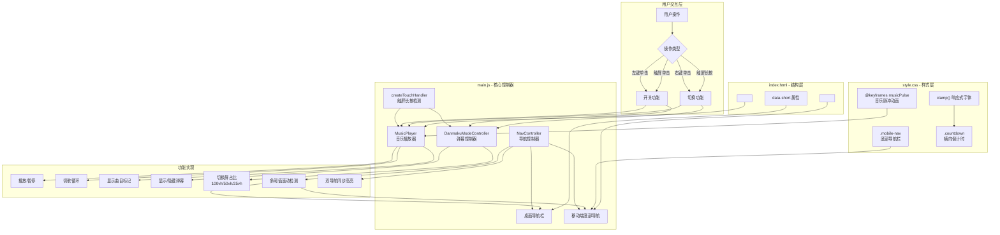

## 1. 高层摘要 (TL;DR)

**影响范围：** 🟡 **中等** - 主要为移动端体验优化和交互功能增强

**核心变更：**
- 📱 新增移动端底部导航栏，优化小屏浏览体验
- 🎵 音乐播放器支持多首歌曲切换，新增右键/长按切歌功能
- 💬 弹幕控制器重构，分离开关与屏占比控制
- 👆 新增通用触屏长按检测工具，优化移动端交互
- 📐 倒计时、字体大小等组件全面响应式适配

---

## 2. 可视化概览 (逻辑架构图)



---

## 3. 详细变更分析

### 📱 **移动端适配组件**

#### **新增移动端底部导航栏**
| 特性 | 桌面端 | 移动端 |
|------|--------|--------|
| 位置 | 顶部固定 | 底部固定 |
| 显示方式 | 横向文字 | 图标+文字 |
| 交互 | 点击跳转 | 点击跳转 |
| 样式 | `.nav` | `.mobile-nav` |

**关键变更：**
- **HTML 结构** (Source: `index.html`): 新增 `<nav class="mobile-nav">`，包含 7 个导航项，每个项使用图标（♡、✦、✿ 等）和中文标签
- **CSS 样式** (Source: `assets/css/style.css`):
  - 移动端隐藏桌面导航：`.nav { display: none !important; }`
  - 底部导航固定定位：`position: fixed; bottom: 0;`
  - 毛玻璃效果：`backdrop-filter: blur(16px);`
  - 适配安全区域：`padding-bottom: env(safe-area-inset-bottom)`
  - `z-index: 1000` 确保在最上层

#### **倒计时组件移动端优化**
| 属性 | 旧值 | 新值 |
|------|------|------|
| 布局方式 | `grid-template-columns: repeat(2, 1fr)` | `display: flex; flex-direction: row;` |
| 最大宽度 | `320px` | `none` (全宽) |
| 间距 | `8px` | `6px` |
| 数字字体 | `22px` | `clamp(14px, 5vw, 20px)` |

**影响：** 移动端倒计时从 2×2 网格改为横向一行显示，充分利用屏幕宽度。

#### **字体大小响应式调整**
| 元素 | 旧值 | 新值 |
|------|------|------|
| `.date-text` | `70px` | `clamp(36px, 10vw, 70px)` |
| `.name-line-1` | `clamp(24px, 6vw, 36px)` | `clamp(32px, 9vw, 52px)` |
| `.name-line-2` | `clamp(20px, 5vw, 32px)` | `clamp(28px, 8vw, 46px)` |
| `.romaji-text` | - | `clamp(10px, 2.5vw, 16px)` |
| `.birthday-text` | - | `clamp(9px, 1.8vw, 14px)` |

---

### 🎵 **音乐播放器功能增强**

#### **新增播放列表支持**
```javascript
// Source: assets/js/main.js
this.playlist = [
  { src: './assets/audio/bgm_01_main.mp3', badge: '♭' },
  { src: './assets/audio/bgm_02_spring.mp3', badge: '♮' },
  { src: './assets/audio/bgm_03_sakura.mp3', badge: '♯' },
];
```

#### **交互方式升级**
| 操作 | 桌面端 | 移动端 |
|------|--------|--------|
| 开关音乐 | 左键单击 | 触屏单击 |
| 切换歌曲 | 右键单击 | 触屏长按 (450ms) |

**关键方法：**
- `loadTrack(index)`: 加载指定曲目
- `switchTrack()`: 循环切换到下一首
- `createTouchHandler()`: 通用触屏长按检测

#### **HTML 结构变更**
```html
<!-- 旧版本 -->
<audio id="bgMusic" loop>
  <source src="./assets/audio/background_music.mp3" type="audio/mpeg">
</audio>

<!-- 新版本 -->
<audio id="bgMusic" preload="metadata"></audio>
<span class="btn-badge" id="musicBadge"></span>
```

---

### 💬 **弹幕控制器重构**

#### **逻辑分离**
| 功能 | 旧实现 | 新实现 |
|------|--------|--------|
| 状态管理 | 单一 `mode` 数组 | 分离 `_isOn` 和 `_sizeMode` |
| 开关弹幕 | 切换 mode 索引 | 直接切换 `_isOn` 布尔值 |
| 切换屏占比 | 随 mode 变化 | 独立 `cycleSize()` 方法 |

#### **交互方式**
| 操作 | 效果 |
|------|------|
| 左键单击 / 触屏单击 | 开关弹幕 |
| 右键单击 / 触屏长按 | 循环切换屏占比 (100vh → 50vh → 25vh) |

#### **屏占比模式**
```javascript
// Source: assets/js/main.js
this._sizeModes = [
  { height: '100vh', badge: '' },      // 全屏
  { height: '50vh', badge: '1/2' },    // 半屏
  { height: '25vh', badge: '1/4' },    // 四分之一屏
];
```

---

### 🧭 **导航控制器优化**

#### **IntersectionObserver 多阈值检测**
```javascript
// 旧版本
{ threshold: 0.5 }  // 单一阈值

// 新版本
{ threshold: [0, 0.1, 0.2, 0.3, 0.4, 0.5, 0.6, 0.7, 0.8, 0.9, 1] }
```

**改进点：** 使用多阈值检测，通过 `intersectionRatio` 精确计算哪个页面在视口中占比最大，避免滚动时导航高亮跳动。

#### **双导航同步高亮**
```javascript
// Source: assets/js/main.js
applyActiveNav(pageNum) {
  // 桌面端导航
  this.navItems.forEach(item => {
    item.classList.toggle('active', item.dataset.page === pageNum);
  });
  // 移动端导航
  if (this.mobileNavItems.length) {
    this.mobileNavItems.forEach(item => {
      item.classList.toggle('active', item.dataset.page === pageNum);
    });
  }
}
```

---

### 👆 **触屏交互工具**

#### **通用长按检测函数**
```javascript
// Source: assets/js/main.js
function createTouchHandler(onTap, onLongPress, thresholdMs = 500) {
  let timer = null;
  let canceled = false;
  return {
    start() {
      canceled = false;
      timer = setTimeout(() => {
        if (!canceled) {
          canceled = true;
          onLongPress();
        }
        timer = null;
      }, thresholdMs);
    },
    end() {
      if (timer) { clearTimeout(timer); timer = null; }
      if (!canceled) onTap();
      canceled = false;
    },
    cancel() {
      canceled = true;
      if (timer) { clearTimeout(timer); timer = null; }
    }
  };
}
```

**使用场景：**
- 音乐播放器：单击开关，长按切歌
- 弹幕控制器：单击开关，长按切换屏占比

---

### 🎨 **CSS 样式增强**

#### **音乐按钮脉冲动画**
```css
/* Source: assets/css/style.css */
#musicBtn.on {
  animation: musicPulse 2s ease-in-out infinite;
}

@keyframes musicPulse {
  0%, 100% {
    box-shadow: 0 2px 12px rgba(255, 183, 197, 0.4);
  }
  50% {
    box-shadow: 0 2px 18px rgba(212, 112, 138, 0.6);
  }
}
```

#### **控制按钮位置调整**
| 屏幕尺寸 | 旧位置 | 新位置 |
|----------|--------|--------|
| 移动端 | `bottom: 16px` | `bottom: 80px` |

**原因：** 避开新增的底部导航栏（高度约 72px）。

---

### 📄 **HTML 结构微调**

#### **导航项新增短标签**
```html
<!-- Source: index.html -->
<span class="nav-item" data-page="1" data-short="序">プロローグ</span>
<span class="nav-item" data-page="2" data-short="档">アーカイブ</span>
<!-- ... -->
```

#### **致谢信息更新**
| 位置 | 旧内容 | 新内容 |
|------|--------|--------|
| 制作者 | 羽川響 | 羽川響 BronySunset |
| 贡献者 | 切片man（...） | 曦月、チョウ、空白的音符、切片组（...） |
| 特别感谢 | 空 | 各位支持猫羽おかゆ、提供留言和视频支持的粉丝们 |

---

## 4. 影响与风险评估

### ⚠️ **潜在风险**

| 风险项 | 描述 | 缓解措施 |
|--------|------|----------|
| **音频资源缺失** | 新增了 3 个音频文件路径，需确保文件存在 | 检查 `assets/audio/` 目录下是否有对应文件 |
| **触屏事件冲突** | 同时绑定 click 和 touch 事件可能导致重复触发 | 使用 `_touchFired` 标志位防止重复触发 |
| **底部导航遮挡** | 移动端底部内容可能被导航栏遮挡 | 添加 `padding-bottom: 72px` 到 body |
| **浏览器兼容性** | `backdrop-filter` 和 `env()` 在旧浏览器不支持 | 提供降级样式 |

### ✅ **测试建议**

1. **移动端测试**
   - [ ] 在不同尺寸手机上测试底部导航栏显示
   - [ ] 验证倒计时在小屏上的横向布局
   - [ ] 测试安全区域适配（iPhone 刘海屏）

2. **交互测试**
   - [ ] 音乐播放器：测试左键/右键/单击/长按功能
   - [ ] 弹幕控制器：测试开关和屏占比切换
   - [ ] 导航滚动：测试多页面滚动时的高亮准确性

3. **兼容性测试**
   - [ ] iOS Safari 测试触屏长按
   - [ ] Android Chrome 测试毛玻璃效果
   - [ ] 旧版浏览器测试降级显示

4. **资源测试**
   - [ ] 确认 3 个音频文件可正常播放
   - [ ] 测试音频切换时的流畅性

---

## 5. 变更文件清单

| 文件 | 变更类型 | 主要变更内容 |
|------|----------|--------------|
| `index.html` | 结构变更 | 新增移动端导航栏、音乐按钮标记、更新致谢信息 |
| `assets/css/style.css` | 样式增强 | 移动端底部导航样式、响应式字体、音乐脉冲动画 |
| `assets/js/main.js` | 功能增强 | 触屏长按检测、音乐播放列表、弹幕控制器重构、导航优化 |

---