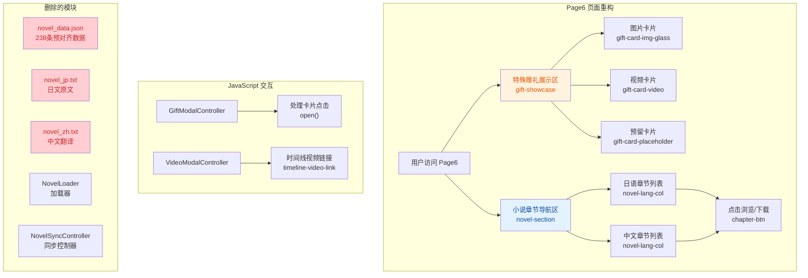

## 1. 高层摘要 (TL;DR)

*   **影响范围:** 🟡 **中等** - 主要是Page6页面的重构和小说模块的架构调整
*   **核心变更:**
    *   ✨ Page6页面从"双语对照阅读"模式重构为"章节导航+下载"模式
    *   🗑️ 删除了构建期预对齐的`novel_data.json`及原文文件
    *   🎨 新增手账便签风格的特殊赠礼展示区
    *   📝 更新了时间线内容,新增"超长耐久回"和"联动"事件
    *   🔧 修复了昵称标签样式和时间线视频链接交互
    **尚未完成内容:**
    *   多数信息内容未填写，视频链接、图片未上传

---

## 2. 视觉概览 (代码与逻辑映射)



---

## 3. 详细变更分析

### 📄 **3.1 Page6 页面重构** (`index.html`)

#### 🎯 **变更目标**
将Page6从"双语对照在线阅读"模式改为"章节导航+文件下载"模式,简化实现并提升用户体验。

#### 📋 **具体变更**

| 组件 | 变更前 | 变更后 | 说明 |
|------|--------|--------|------|
| **特殊赠礼区** | 简单的3个预留卡片 | 手账便签风格的三卡片展示 | 新增毛玻璃覆盖、胶带装饰、播放按钮等 |
| **小说展示** | 双语对照滚动阅读 | 双栏章节导航列表 | 每章提供"浏览"和"下载"按钮 |
| **数据源** | `novel_data.json` (预对齐) | 直接链接到txt文件 | 删除了复杂的对齐逻辑 |

#### 🏗️ **新增HTML结构**

```html
<!-- 特殊赠礼展示区 -->
<div class="gift-showcase">
  <div class="gift-card gift-card-img-glass">...</div>  <!-- 左侧蝶的插画 -->
  <div class="gift-card gift-card-video">...</div>      <!-- 中间:视频预留 -->
  <div class="gift-card gift-card-placeholder">...</div> <!-- 右侧:预留 -->
</div>

<!-- 小说章节导航 -->
<div class="novel-section">
  <div class="novel-lang-row">
    <div class="novel-lang-col">
      <!-- 日语7章 -->
      <div class="chapter-item">
        <a href="./assets/novel/jp/01_第01章_雨夜の弦音、異世界からの来訪者.txt" 
           class="chapter-btn" target="_blank">浏览</a>
        <a href="..." class="chapter-btn chapter-btn-download" download>下载</a>
      </div>
    </div>
    <div class="novel-lang-col">
      <!-- 中文7章 -->
    </div>
  </div>
</div>
```

---

### 🎨 **3.2 CSS 样式重构** (`assets/css/style.css`)

#### 📊 **样式变更表**

| 样式类 | 变更类型 | 说明 |
|--------|----------|------|
| `.nickname-text` → `.nickname-tags` | 重构 | 昵称从文本改为标签样式 |
| `.timeline-video-link` | 新增 | 时间线内嵌视频链接样式 |
| `.gift-hero` | 新增 | 主视觉横幅(手账风格) |
| `.gift-showcase` | 新增 | 三卡片网格布局 |
| `.gift-card` | 新增 | 礼物卡片基础样式 |
| `.gift-tape` | 新增 | 胶带装饰 |
| `.glass-overlay` | 新增 | 毛玻璃覆盖层 |
| `.novel-section` | 新增 | 小说章节导航容器 |
| `.chapter-list` | 新增 | 章节列表样式 |
| `.download-btn` | 新增 | 下载按钮样式 |

#### 🔍 **关键样式细节**

**昵称标签样式:**
```css
.nickname-tags {
  display: flex;
  flex-wrap: wrap;
  gap: 10px;
  justify-content: center;
}

.nickname-tag {
  padding: 5px 14px;
  background: rgba(255, 245, 248, 0.9);
  border: 1px solid rgba(212, 112, 138, 0.18);
  border-radius: 20px;
  transition: all 0.25s ease;
}
```

**毛玻璃覆盖层:**
```css
.glass-overlay {
  position: absolute;
  bottom: 0;
  left: 0;
  right: 0;
  padding: 20px 18px 16px;
  background: linear-gradient(0deg, rgba(255,255,255,0.75) 0%, 
                                   rgba(255,255,255,0.35) 60%, 
                                   transparent 100%);
  backdrop-filter: blur(2px);
}
```

---

### ⚙️ **3.3 JavaScript 逻辑调整** (`assets/js/main.js`)

#### 🔄 **GiftModalController 更新**

| 方法 | 变更内容 | 原因 |
|------|----------|------|
| `bindGiftItemClick()` | 选择器 `.gift-item` → `.gift-card` | 匹配新的HTML结构 |
| `open()` | 添加 `video-mode` CSS类 | 与Page4视频弹窗保持一致 |
| `open()` | 占位提示文本改为日文 | 风格统一 |

#### 🗑️ **删除的代码**

```javascript
// 删除了小说加载和同步控制器
const novelLoader = new NovelLoader({
  onLoadComplete: () => {
    const novelSyncController = new NovelSyncController();
    novelSyncController.init();
  }
});
await novelLoader.load();
```

#### ✨ **新增功能**

```javascript
// 时间线内嵌视频链接点击处理
document.querySelectorAll('.timeline-video-link').forEach(link => {
  link.addEventListener('click', (e) => {
    e.preventDefault();
    e.stopPropagation();
    videoModalController.open({
      title: link.dataset.title || '',
      url: link.dataset.url || '',
      desc: link.textContent || ''
    });
  });
});
```

---

### 📝 **3.4 内容更新** (`index.html`)

#### 🎭 **人物设定更新**

| 字段 | 旧值 | 新值 |
|------|------|------|
| 人物描述 | `111` | `一只三岁的爱唱歌的软软猫猫哦~` |
| 标签 | `#タグ3` | `#猫粥宝` |
| 昵称 | `猫猫·粥酱·白粥·皮卡粥·事故势猫猫` | `ねこちゃん·おかゆちゃん·おかゆん·白粥·事故势猫猫` |
| 口癖 | `口癖4 / 中文 / 意味/使い方` | `ははははは~ / 哈哈哈哈~ / 这健康的笑声总是响彻直播间~` |

#### 📅 **时间线事件更新**

| 事件 | 变更 |
|------|------|
| **删除** | "涨粉潮" (2026.4.19) - 合并到"初次相遇" |
| **修改** | "初次相遇" - 添加了视频链接,合并涨粉数据 |
| **新增** | "超长耐久回" (2026.5.21) - 整整直播了八个小时 |
| **新增** | "和すみれちゃん联动" (2026.5.23) - 联动直播问答 |
| **修改** | "百舰了!" - 添加感叹号,语气更强烈 |
| **修改** | "初配信" - 添加"实则后边也是,不愧是事故势(笑)" |

---

### 🗂️ **3.5 文件删除与新增**

#### ❌ **删除的文件**

| 文件 | 大小 | 说明 |
|------|------|------|
| `COMPREHENSIVE_REPORT.md` | 233行 | 项目综合报告文档 |
| `novel_data.json` | 1192行 | 中日小说预对齐数据(238条) |
| `novel_jp.txt` | 239行 | 日文小说原文 |
| `novel_zh.txt` | 239行 | 中文小说翻译 |

---

## 4. 影响与风险评估

### ⚠️ **破坏性变更**

| 变更项 | 影响范围 | 风险等级 | 建议 |
|--------|----------|----------|------|
| 删除`novel_data.json` | Page6小说阅读功能 | 🟡 中 | 确保txt文件路径正确 |
| 删除`NovelLoader`/`NovelSyncController` | 小说同步高亮功能 | 🟡 中 | 已替换为章节导航模式 |
| CSS类名变更 | Page6样式 | 🟢 低 | 已同步更新HTML和JS |

### 🧪 **测试建议**

1.  **Page6 特殊赠礼区:**
    *   ✅ 验证图片卡片毛玻璃效果
    *   ✅ 验证视频卡片播放按钮交互
    *   ✅ 验证预留卡片占位符显示

2.  **Page6 小说导航:**
    *   ✅ 验证日语章节"浏览"按钮链接正确
    *   ✅ 验证中文章节"下载"按钮触发下载
    *   ✅ 验证章节悬停效果

3.  **时间线功能:**
    *   ✅ 验证"自我介绍视频"链接点击打开弹窗
    *   ✅ 验证新增时间线事件显示正确

4.  **响应式布局:**
    *   ✅ 移动端昵称标签换行正常
    *   ✅ 小说章节列表在小屏幕上的显示

---

## 5. 变更总结

| 类别 | 变更数量 | 状态 |
|------|----------|------|
| **页面重构** | 1个(Page6) | ✅ 完成 |
| **样式变更** | ~500行CSS | ✅ 完成 |
| **逻辑调整** | ~20行JS | ✅ 完成 |
| **内容更新** | 5处文本 | ✅ 完成 |
| **文件删除** | 4个 | ✅ 完成 |
| **文件新增** | 2个(备份) | ✅ 完成 |

---

**变更时间:** 2026-05-21  
**影响模块:** Page6、时间线、昵称显示  
**架构调整:** 从"前端运行时对齐"切换到"静态文件+导航"模式