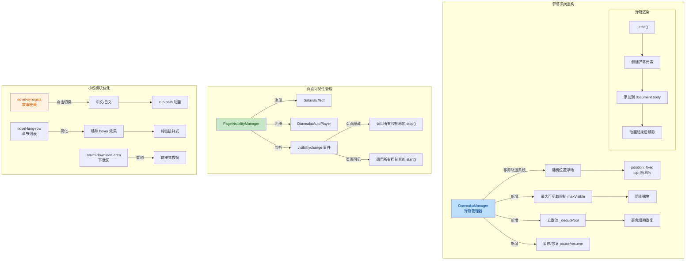

## 1. 高层摘要 (TL;DR)

*   **影响范围：** 🟡 **中等** - 重构弹幕系统、优化小说展示模块、清理冗余代码
*   **核心变更：**
    *   🎯 **弹幕系统重构**：移除轨道机制，改为随机位置浮动 + 去重机制
    *   📖 **小说模块优化**：新增故事梗概（中日双语切换）、简化章节列表样式
    *   🧹 **代码清理**：删除未使用的样式类和方法（如 `NovelLoader`、`preference-grid` 等）
    *   ⚡ **性能优化**：新增 `PageVisibilityManager` 实现后台节流、滚动事件使用 `requestAnimationFrame`

---

## 2. 可视化概览 (逻辑架构图)



---

## 3. 详细变更分析

### 🎨 样式层变更 (`assets/css/style.css`)

#### 3.1 弹幕系统样式重构

| 属性 | 旧值 | 新值 | 说明 |
|------|------|------|------|
| `top` | `0` | `90px` | 避开导航栏 |
| `height` | `60vh` | `calc(60vh - 90px)` | 动态计算高度 |
| `z-index` | `500` | `9999` | 提升层级 |
| `contain` | `strict` | `layout style` | 优化渲染性能 |
| `mask-image` | 无 | `linear-gradient(...)` | 软边界渐变遮罩 |

**弹幕项样式优化：**
- 背景透明度：`0.75` → `0.8`
- 添加文字描边：`text-shadow: 0 0 2px rgba(255,255,255,0.8)...`
- Hover 缩放：`scale(1.05)` → `scale(1.08)`
- Hover z-index：`31` → `100`

#### 3.2 小说模块样式重构

| 旧类名 | 新类名/状态 | 变更说明 |
|--------|-------------|----------|
| `.gift-divider` | `.book-divider` | 分割线样式简化 |
| `.gift-divider-title` | `.book-divider-title` | 字体增大至 22px |
| `.novel-lang-header` | `.novel-lang-label` | 简化为纯文本标签 |
| `.chapter-btn` | `.chapter-actions a` | 改为链接样式，移除按钮外观 |
| `.download-btn` | `.novel-download-link` | 改为下划线链接样式 |

**新增样式：**
- `.novel-synopsis` - 故事梗概容器
- `.novel-synopsis-hint` - 语言切换提示
- `@keyframes synopsisFadeOut/In` - 切换动画

#### 3.3 删除的冗余样式

以下样式类已被移除（未使用）：
- `.preference-grid`, `.preference-item`, `.pref-label`
- `.song-list`, `.song-item`, `.song-title`
- `.sns-list`, `.sns-item`, `.sns-name`, `.sns-link`
- `.message-header-inner`, `.message-avatar`, `.message-sender`, `.message-text`, `.message-time`
- `.loading-text`

---

### 📜 JavaScript 逻辑变更 (`assets/js/main.js`)

#### 3.4 弹幕管理器核心重构

**移除的轨道系统：**
```javascript
// 旧代码 - 已删除
this.trackCount = this.isMobile ? 3 : 6;
this.trackTops = this.isMobile ? [10, 28, 46] : [8, 16, 24, 32, 40, 48];
this.trackOccupied = new Array(this.trackCount).fill(false);
```

**新增随机位置机制：**
```javascript
// 新代码
const topPct = Math.random() * 100;
const absoluteTop = containerTop + (containerHeight * topPct / 100);
el.style.top = `${absoluteTop}px`;
el.style.position = 'fixed';
```

**新增去重机制：**
```javascript
_isDuplicate(text) {
  const key = text.trim().slice(0, 20);
  return this._dedupPool.includes(key);
}
```

**新增控制方法：**
| 方法 | 功能 |
|------|------|
| `pause()` | 暂停发射新弹幕 |
| `resume()` | 恢复发射 |
| `hideAll()` | 隐藏所有弹幕但保持动画 |
| `showAll()` | 显示所有弹幕 |
| `clear()` | 清空所有弹幕和去重池 |

#### 3.5 新增页面可见性管理器

```javascript
class PageVisibilityManager {
  register(controller) {
    // 注册拥有 start()/stop() 方法的控制器
  }
  
  _handleVisibility() {
    if (document.hidden) {
      this._controllers.forEach(c => c.stop());
    } else {
      this._controllers.forEach(c => c.start());
    }
  }
}
```

**注册的模块：**
- `SakuraEffect` - 樱花飘落效果
- `DanmakuAutoPlayer` - 弹幕自动播放器

#### 3.6 滚动事件优化

**旧代码：**
```javascript
this._scrollHandler = () => this.update();
window.addEventListener('scroll', this._scrollHandler);
```

**新代码（节流优化）：**
```javascript
this._pendingUpdate = false;
this._scrollHandler = () => {
  if (this._pendingUpdate) return;
  this._pendingUpdate = true;
  requestAnimationFrame(() => {
    this._pendingUpdate = false;
    this.update();
  });
};
window.addEventListener('scroll', this._scrollHandler, { passive: true });
```

#### 3.7 删除的代码

| 删除项 | 原因 |
|--------|------|
| `formatTime()` | 未使用 |
| `validateBilibiliUrl()` | 未使用 |
| `ImageSlider.goTo()` | 未使用 |
| `NovelLoader` 类 | 小说改为静态展示，无需动态加载 |
| `DanmakuSender` 类 | 项目中无弹幕发送表单 |

---

### 📄 HTML 结构变更 (`index.html`)

#### 3.8 导航与标题更新

| 元素 | 旧内容 | 新内容 |
|------|--------|--------|
| 导航项 | `特殊贈り物` | `デジタルギフト` |
| Page2 标题 | `この世界で一番可愛い猫ちゃんについて` | `アーカイブ · Profile Archive` |
| Page3 标题 | `猫羽おかゆの軌跡` | `軌跡 · Timeline` |

#### 3.9 新增视频"加载更多"功能

```html
<!-- 新增隐藏视频卡片 -->
<div class="video-card video-more-hidden" data-title="..." data-url="..." data-desc="...">
  ...
</div>
<button class="video-load-more" id="videoLoadMoreBtn">查看更多 ▾</button>
```

#### 3.10 小说模块结构重构

**新增故事梗概区域：**
```html
<div class="novel-synopsis" id="novelSynopsis">
  <div class="novel-synopsis-inner">
    <div class="novel-synopsis-cn">...</div>
    <div class="novel-synopsis-jp">...</div>
  </div>
  <div class="novel-synopsis-hint" id="novelSynopsisHint">日本語で読む ▸</div>
</div>
```

**简化章节列表结构：**
```html
<!-- 旧结构 -->
<div class="novel-lang-header">
  <span class="lang-dot jp"></span>
  <span class="lang-name">日本語</span>
  <span class="lang-action">Japanese</span>
</div>

<!-- 新结构 -->
<div class="novel-lang-label">日本語 <span>Japanese</span></div>
```

**下载区域简化：**
```html
<!-- 旧结构 -->
<div class="download-buttons">
  <a href="..." class="download-btn" download>日本語 全文 .txt</a>
  <a href="..." class="download-btn" download>中文全文 .txt</a>
</div>

<!-- 新结构 -->
<a href="..." class="novel-download-link" download>日本語 全文 .txt</a>
<a href="..." class="novel-download-link" download>中文全文 .txt</a>
```

---

### 📝 数据层变更 (`assets/js/danmaku-data.js`)

| 行号 | 旧内容 | 新内容 | 变更类型 |
|------|--------|--------|----------|
| 6 | `cnText: '【奇才天纵!!天使降临!!——猫羽粥酱！!】'` | `cnText: '【奇才天纵!!天使降临!!——猫羽粥酱!!】'` | 文本修正 |
| 36 | `text: '...(♡>𖥦<)/♥'` | `text: '...♥'` | 移除特殊字符 |
| 56 | `name: '【匿名猫粥宝】'` | `name: '【元桑的糕冷】'` | 用户名修正 |

---

## 4. 影响与风险评估

### ⚠️ 破坏性变更

| 变更项 | 影响范围 | 风险等级 |
|--------|----------|----------|
| 弹幕系统重构 | 所有弹幕显示逻辑 | 🟡 中等 - 需要测试弹幕流畅度 |
| 删除 `NovelLoader` 类 | 依赖该类的代码（如有） | 🟢 低 - 确认无外部依赖 |
| 小说样式类名变更 | 自定义样式覆盖 | 🟢 低 - 确认无外部CSS覆盖 |

### ✅ 测试建议

1. **弹幕系统测试：**
   - 验证弹幕随机分布是否均匀
   - 测试弹幕去重功能是否正常工作
   - 检查弹幕 hover 暂停效果
   - 验证弹幕模式切换（全屏/半屏/关闭）

2. **小说模块测试：**
   - 测试故事梗概的中日切换动画
   - 验证章节链接点击跳转
   - 检查下载链接是否正常工作

3. **性能测试：**
   - 切换标签页后验证弹幕和樱花效果是否停止
   - 切回标签页后验证效果是否恢复
   - 滚动页面时检查性能（无卡顿）

4. **兼容性测试：**
   - 移动端弹幕显示是否正常
   - 不同浏览器下的 mask-image 兼容性

### 🎯 优化收益

| 优化项 | 预期收益 |
|--------|----------|
| 弹幕去重机制 | 减少重复内容，提升观看体验 |
| 页面可见性管理 | 后台时节省CPU/内存资源 |
| 滚动事件节流 | 减少不必要的重绘，提升滚动流畅度 |
| 删除冗余代码 | 减少文件体积，提升加载速度 |

---