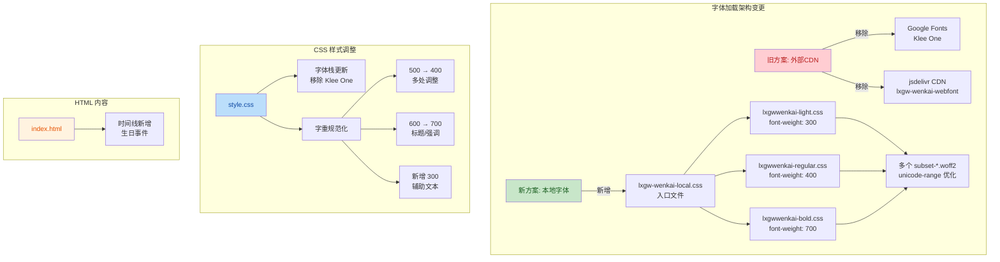
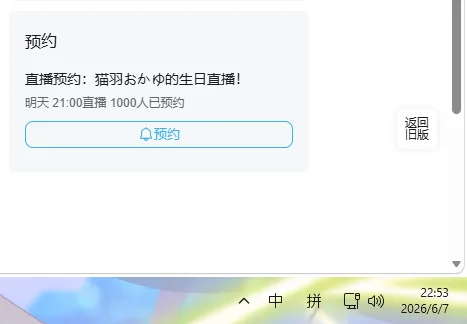

## 1. 高层摘要 (TL;DR)

*   **影响范围：** 🟡 **中等** - 重构了整个字体加载系统，从外部 CDN 迁移到本地字体文件，并统一调整了全局字重规范
*   **核心变更：**
    *   🔄 移除外部 CDN 字体引用（Google Fonts + jsdelivr），改用本地字体子集文件
    *   📦 新增 4 个字体配置文件，支持 300/400/700 三个字重，使用 unicode-range 优化加载
    *   🎨 统一调整 CSS 字重规范（500→400，600→700），新增 300 字重用于辅助文本
    *   📅 时间线新增生日事件记录

---

## 2. 可视化概览 (代码与逻辑映射)



---

## 3. 详细变更分析

### 📦 组件一：字体系统重构

#### 变更说明
将字体加载方式从外部 CDN 完全迁移到本地字体文件系统，并采用 unicode-range 子集分割技术优化加载性能。

#### 新增文件结构

| 文件名 | 用途 | 字重 | 子集数量 |
|--------|------|------|----------|
| `assets/fonts/lxgw-wenkai-local.css` | 字体入口文件 | - | 导入3个字重文件 |
| `assets/fonts/lxgwwenkai-light.css` | 细体字重 | 300 | 40+ 个 subset |
| `assets/fonts/lxgwwenkai-regular.css` | 常规字重 | 400 | 40+ 个 subset |
| `assets/fonts/lxgwwenkai-bold.css` | 粗体字重 | 700 | 40+ 个 subset |

#### 字体子集优化示例
每个字重文件按 Unicode 范围分割成多个 `@font-face` 声明：

```css
/* LXGW WenKai [4] - Bold */
@font-face {
  font-family: 'LXGW WenKai';
  font-style: normal;
  font-weight: 700;
  font-display: swap;
  src: url('./lxgwwenkai-bold-subset-4.woff2') format('woff2');
  unicode-range: U+1f1e9-1f1f5, U+1f1f7-1f1ff, ...; /* Emoji 等符号 */
}
```

**优势：**
- ✅ 按需加载：浏览器只下载页面实际使用的字符子集
- ✅ 减少带宽：相比完整字体文件，大幅降低传输体积
- ✅ 提升性能：`font-display: swap` 确保文本快速显示

---

### 🎨 组件二：CSS 样式规范化

#### 字体栈更新

| 属性 | 旧值 | 新值 | 说明 |
|------|------|------|------|
| `--font-display` | `'LXGW WenKai', 'Klee One', serif` | `'LXGW WenKai', 'PingFang SC', 'Microsoft YaHei', serif` | 移除 Klee One，添加系统字体兜底 |

#### 字重规范化调整

**统一调整规则：**
- **500 → 400**：常规文本、按钮、标签等
- **600 → 700**：标题、强调文本、数字等
- **新增 300**：辅助说明、次要文本

**受影响的主要选择器：**

| 选择器 | 旧字重 | 新字重 | 元素类型 |
|--------|--------|--------|----------|
| `.nav-item` | - | 400 | 导航项 |
| `.nav-item.active` | 500 | 700 | 激活导航 |
| `.birthday-text` | - | 300 | 生日文本 |
| `.romaji-text` | - | 300 | 罗马音文本 |
| `.profile-text` | - | 400 | 个人简介 |
| `.cd-cell .num` | 600 | 700 | 倒计时数字 |
| `.cd-caption .date` | 600 | 700 | 日期强调 |
| `.info-label` / `.info-value` | 500 | 400 | 信息标签/值 |
| `.mini-card-header h4` | 600 | 700 | 小卡片标题 |
| `.feature-card-header h3` | 600 | 700 | 特性卡片标题 |
| `.video-title` | 600 | 700 | 视频标题 |
| `.gift-card-title` | 600 | 700 | 礼物卡片标题 |
| `.book-divider-title` | 600 | 700 | 书籍分隔标题 |
| `.gift-modal-title` | 600 | 700 | 礼物弹窗标题 |

---

### 📅 组件三：HTML 内容更新

#### 时间线新增事件

在 `index.html` 的时间线区域新增了一条生日事件记录：

```html
<div class="timeline-item highlight">
  <div class="timeline-dot"></div>
  <div class="timeline-tooltip">
    <div class="tooltip-arrow"></div>
    
    <span class="tooltip-caption">点击放大</span>
  </div>
  <p class="timeline-date">2026.6.8</p>
  <p class="timeline-title" data-ja="誕生日だ！" data-cn="生日啦！">誕生日だ！</p>
  <p class="timeline-desc" data-ja="前日の22時53分（日本時間）、誕生日記念配信の予約が1000人を突破しました！みんなと猫猫が一緒に過ごす初めての誕生日です！" data-cn="在前一天的22:53（日本时间）生日回直播预约突破1000人！这是大家和猫猫过的第一个生日！">...</p>
</div>
```

**事件详情：**
- 📅 日期：2026.6.8
- 🎉 事件：生日庆祝
- 📊 里程碑：生日直播预约突破 1000 人
- 🖼️ 特色：带有点击放大图片的 tooltip

---

## 4. 影响与风险评估

### ⚠️ 破坏性变更

| 变更类型 | 影响范围 | 风险等级 | 说明 |
|----------|----------|----------|------|
| 字体文件路径 | 全局 | 🟡 中等 | 需确保所有 `.woff2` 子集文件已正确部署到 `assets/fonts/` 目录 |
| 字重值调整 | 全局 | 🟢 低 | 视觉上更清晰，但需检查是否有依赖特定字重的布局 |

### 🧪 测试建议

1.  **字体加载测试**
    - ✅ 验证页面首次加载时字体是否正确显示（无 FOUT/FoIT）
    - ✅ 检查网络面板，确认只加载了页面实际使用的字符子集
    - ✅ 测试不同语言内容（中文、日文、Emoji）的渲染效果

2.  **视觉回归测试**
    - ✅ 对比调整前后的字重效果，确保标题/正文层次清晰
    - ✅ 检查导航项、按钮、卡片标题等关键元素的视觉权重
    - ✅ 验证 300 字重的辅助文本是否清晰可读

3.  **功能测试**
    - ✅ 测试时间线新增的生日事件交互（tooltip 点击放大）
    - ✅ 验证中日文切换功能正常

4.  **兼容性测试**
    - ✅ 测试不同浏览器的 `font-display: swap` 表现
    - ✅ 验证系统字体回退机制（`PingFang SC`, `Microsoft YaHei`）

### 📌 注意事项

- ⚠️ **字体文件部署**：确保所有 `lxgwwenkai-*-subset-*.woff2` 文件（约 120+ 个）已正确上传到服务器
- ⚠️ **缓存策略**：字体文件变更后，可能需要清理 CDN 缓存或更新版本号
- 💡 **性能监控**：建议监控字体加载时间，对比迁移前后的性能指标