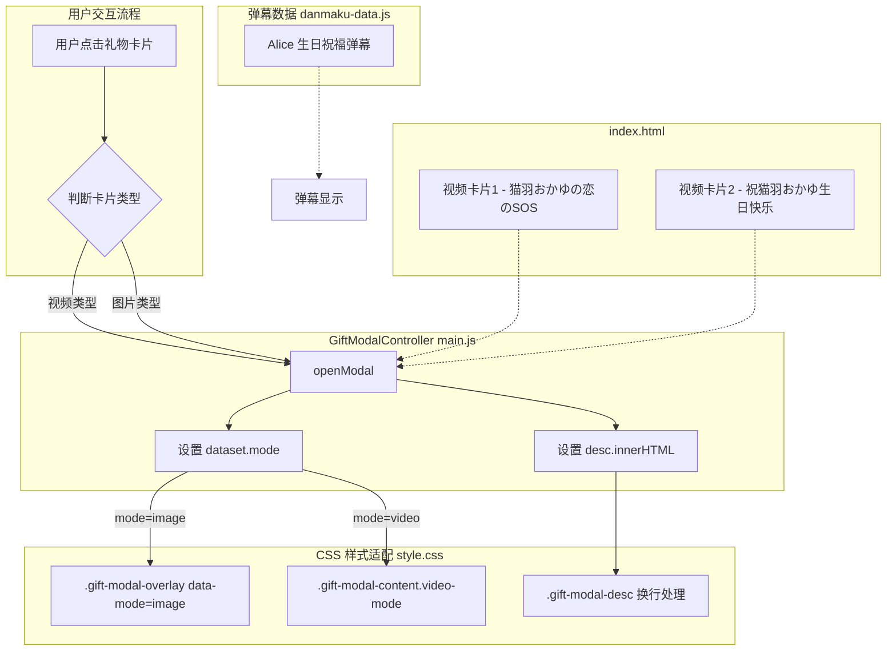

## 1. 高层摘要（TL;DR）

*   **影响范围：** 🟡 **中等** - 优化礼物弹窗的响应式布局和显示效果，新增弹幕祝福内容
*   **核心变更：**
    *   📱 优化礼物弹窗在图片/视频模式下的自适应布局，改善移动端体验
    *   🎨 调整视频卡片描述文字颜色，提升可读性
    *   ✉️ 新增一条来自 "Alice" 的生日弹幕祝福
    *   📝 更新两个视频卡片的占位符内容为实际视频信息

---

## 2. 可视化概览（代码与逻辑图）



---

## 3. 详细变更分析

### 🎨 样式优化（`assets/css/style.css`）

**变更内容：**

| 样式选择器 | 原值 | 新值 | 说明 |
|-----------|------|------|------|
| `.gift-card-video-glass .gift-card-desc` | `color: #b09090` | `color: #5d4a4a` | 加深描述文字颜色，提升可读性 |
| `.gift-modal` | `max-width: 90vw` | `width: 90%; max-width: 960px` | 优化弹窗宽度计算逻辑 |
| `.gift-modal-content img` | `width: 100%` | `max-height: calc(90vh - 80px); width: auto` | 图片改为自适应高度，防止溢出 |
| `.gift-modal-content.video-mode` | `width: 85vw` | `width: 100%` | 视频模式宽度改为100% |

**新增样式：**

```css
/* 图片模式 — 弹窗自适应图片大小 */
.gift-modal-overlay[data-mode="image"] .gift-modal {
  width: auto;
  max-width: 90vw;
}

/* 描述文字换行处理 */
.gift-modal-desc {
  word-break: break-word;
  overflow-wrap: break-word;
}

/* 个人页面左侧特性卡片 */
.profile-left-column > .feature-card {
  flex: 1;
}
```

---

### 📝 内容更新（`index.html`）

**视频卡片内容更新：**

| 卡片位置 | 属性 | 原值（占位符） | 新值（实际内容） |
|---------|------|---------------|-----------------|
| 卡片1 | `data-title` | 【预留视频】 | 【偶像大师/MMD】猫羽おかゆの恋のSOS |
| 卡片1 | `data-desc` | 空白の音符 | 空白の音符 |
| 卡片2 | `data-title` | 【预留标题】 | 祝猫羽おかゆ生日快乐 |
| 卡片2 | `data-desc` | 预留描述 | Airer-Archer Noahflan 是钢板哦 贰玖...（多人署名） |

---

### ⚙️ 逻辑增强（`assets/js/main.js`）

**GiftModalController 类更新：**

```javascript
// 视频模式
this.overlay.dataset.mode = 'video';  // 新增：设置模式标识
this.desc.innerHTML = desc || '点击播放视频';  // 改为 innerHTML 支持富文本

// 图片模式  
this.overlay.dataset.mode = 'image';  // 新增：设置模式标识
```

**变更说明：**
- 通过 `dataset.mode` 属性让 CSS 能够区分不同模式，应用不同的布局策略
- 使用 `innerHTML` 替代 `textContent`，允许描述中包含 HTML 标签（如 `<br>` 换行）

---

### ✉️ 弹幕数据新增（`assets/js/danmaku-data.js`）

**新增弹幕条目：**

```javascript
{
  name: '【Alice】',
  text: '【猫羽おかゆさん、こんにちは、アリスです。お誕生日おめでとうございます。これからの配信活動が笑顔と楽しさにあふれますように。これからも、私たち猫羽粥の切り抜きグループはずっとあなたのそばで応援し続けます！】',
  cnText: '【猫羽粥，你好，我是Alice。生日快乐。愿你今后的直播活动充满笑容与快乐。今后，我们猫羽粥的剪辑组也会一直在你身边，继续为你加油！】'
}
```

---

## 4. 影响与风险评估

### ✅ 积极影响
- 📱 **移动端体验提升：** 图片弹窗现在会根据图片尺寸自适应，避免在大屏上过度拉伸
- 🎯 **内容可读性增强：** 视频卡片描述文字颜色加深，更易于阅读
- 🎨 **布局灵活性提高：** 通过 `data-mode` 机制，CSS 可以针对不同内容类型应用最优布局

### ⚠️ 风险点
| 风险项 | 描述 | 建议 |
|--------|------|------|
| **HTML 注入风险** | 使用 `innerHTML` 渲染描述内容 | 确保数据来源可信，或添加 HTML 过滤 |
| **图片尺寸异常** | `max-height: calc(90vh - 80px)` 可能导致超大图片被压缩 | 测试不同尺寸图片的显示效果 |

### 🧪 测试建议
1. **弹窗响应式测试：** 在不同屏幕尺寸下测试图片和视频弹窗的显示效果
2. **内容渲染测试：** 验证描述中包含 `<br>` 等标签时的换行效果
3. **弹幕显示测试：** 确认新增的 Alice 弹幕能正常显示

---