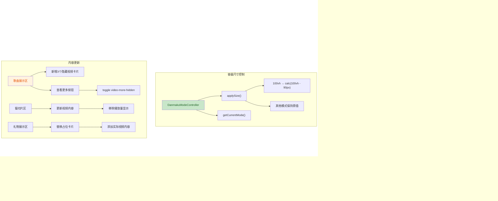

## 1. 高层摘要 (TL;DR)

*   **影响范围：** 中等 - 优化了弹幕显示逻辑，更新了页面内容
*   **核心变更：**
    *   ✨ 实现弹幕智能边界避让系统，防止弹幕遮挡切换线和底部区域
    *   📱 修复移动端安全区域适配问题
    *   🎵 新增歌曲展示的"查看更多"功能，添加3首新歌曲
    *   🎨 优化卡片样式和布局细节

---

## 2. 可视化概览



---

## 3. 详细变更分析

### 🎯 组件一：弹幕系统边界避让 (`assets/js/main.js`)

**变更说明：** 实现了智能弹幕位置计算系统，根据不同屏占比模式自动避开特定区域，防止弹幕遮挡切换线和底部安全区域。

#### 新增配置和方法

| 方法/属性 | 说明 |
|-----------|------|
| `_avoidConfigs` | 边界避让配置数组，定义各模式需避开区域 |
| `_calculateValidRanges()` | 计算有效发射区域（排除避开区域） |
| `_randomPositionInRanges()` | 在有效区域内随机选择位置 |
| `getCurrentMode()` | 获取当前屏占比模式索引 |
| `isOn()` | 获取弹幕开关状态 |

#### 边界避让配置表

| 模式索引 | 屏占比 | 避开区域 | 避开原因 |
|---------|--------|---------|---------|
| 0 | 100vh | 94%-100% | 底部安全区域 |
| 1 | 50vh | 47%-53% | 切换线附近 |
| 2 | 25vh | 22%-28% | 切换线附近 |

**代码片段 - 有效区域计算逻辑：**
```javascript
// 从基础有效区域中减去需要避开的区域
let validRanges = [{ start: safeTop, end: safeBottom }];

for (const avoid of avoidPixelRanges) {
  const newValid = [];
  for (const valid of validRanges) {
    // 左侧剩余有效区域
    if (valid.start < avoid.start) {
      newValid.push({ start: valid.start, end: Math.min(avoid.start, valid.end) });
    }
    // 右侧剩余有效区域
    if (valid.end > avoid.end) {
      newValid.push({ start: Math.max(avoid.end, valid.start), end: valid.end });
    }
  }
  validRanges = newValid;
}
```

---

### 📱 组件二：容器尺寸与安全区域适配 (`assets/js/main.js` + `style.css`)

**变更说明：** 修复了100vh模式下容器超出视口底部的问题，并优化了移动端安全区域适配。

#### 尺寸计算修复

| 模式 | 旧值 | 新值 | 修复说明 |
|-----|------|------|---------|
| 100vh | `100vh` | `calc(100vh - 90px)` | 减去顶部偏移量，避免超出底部 |

#### CSS 安全区域优化

```css
/* 新增安全区域底部内边距 */
height: calc(60vh - 90px - env(safe-area-inset-bottom, 0px));
padding-bottom: env(safe-area-inset-bottom, 0px);
box-sizing: border-box;
```

---

### 🎵 组件三：歌曲展示区扩展 (`index.html` + `main.js`)

**变更说明：** 为歌曲展示区添加了"查看更多"功能，新增3首隐藏歌曲。

#### 新增歌曲内容

| 歌曲标题 | 描述 | 时长 | BVID |
|---------|------|------|------|
| セカイ | 抱き締めながら キミと見たいセカイへ | 03:45 | BV1yREH6SExK |
| 花に亡霊 | 夏の木陰に座った頃... | 04:12 | BV1CGVa6hE2E |
| 地球最後の告白を | 臆病 でも今なら言えるんだ | 04:30 | BV1HPLS6mExY |

**代码片段 - 查看更多功能：**
```javascript
const songLoadMoreBtn = document.getElementById('songLoadMoreBtn');
if (songLoadMoreBtn) {
  let songExpanded = false;
  const hiddenSongs = document.querySelectorAll('.video-section:nth-of-type(2) .video-card.video-more-hidden');
  songLoadMoreBtn.addEventListener('click', () => {
    songExpanded = !songExpanded;
    hiddenSongs.forEach(card => {
      card.classList.toggle('video-more-hidden', !songExpanded);
    });
    songLoadMoreBtn.textContent = songExpanded ? '收起 ▴' : '查看更多 ▾';
  });
}
```

---

### 🎨 组件四：样式优化 (`assets/css/style.css`)

#### 卡片样式调整

| 元素 | 属性 | 旧值 | 新值 |
|-----|------|------|------|
| `.profile-card-header` | padding | `28px 20px 14px` | `18px 20px 12px` |
| `.profile-card-header h3` | font-size | `14px` | `13px` |
| `.feature-card-header` | padding | `28px 20px 14px` | `16px 20px 10px` |
| `.footer` | padding | `60px 24px 60px` | `32px 24px` |

#### 浏览器兼容性增强

为Masonry布局添加了浏览器前缀：

```css
.gift-showcase {
  -webkit-column-count: 2;
  -moz-column-count: 2;
  column-count: 2;
  -webkit-column-gap: 20px;
  -moz-column-gap: 20px;
  column-gap: 20px;
}
```

#### 移除的样式

- ❌ `.video-view-count` - 视频播放量显示样式（已从HTML中移除）

---

### 📝 组件五：内容更新 (`index.html`)

#### 文本修正

| 位置 | 旧文本 | 新文本 |
|-----|--------|--------|
| 时间线 | "边学中文边弹吉他" | "先学中文后弹吉他" |
| Footer | "提供留言和视频支持的粉丝们" | "提供留言和各种礼物支持的粉丝们" |

#### 猫切片区内容更新

| 索引 | 旧标题 | 新标题 | 旧描述 | 新描述 |
|-----|--------|--------|--------|--------|
| 2 | 视频标题2 | 新晋日本萝莉开播两周就速通百舰... | 视频描述2 | 百舰!百舰! |
| 3 | 视频标题3 | 樱花妹唱歌后太兴奋把桌子踹了... | 视频描述3 | 痛い痛い痛い~ |

#### 礼物展示区更新

- 将占位卡片替换为实际视频卡片
- 修正图片路径：`gift_video1.webp` ↔ `gift_video3.webp` 交换

---

## 4. 影响与风险评估

### ⚠️ 潜在风险

| 风险项 | 严重程度 | 说明 | 建议 |
|-------|---------|------|------|
| 弹幕位置计算 | 低 | 新增边界避让逻辑可能影响弹幕分布 | 测试各模式下弹幕显示效果 |
| 容器高度变化 | 低 | 100vh模式高度减小可能影响弹幕显示范围 | 验证底部弹幕是否完整显示 |
| 新增内容 | 低 | 新增歌曲卡片需确保资源文件存在 | 检查图片资源路径 |

### ✅ 测试建议

1. **弹幕显示测试**
   - 切换不同屏占比模式（100vh/50vh/25vh）
   - 验证弹幕不会出现在避开区域
   - 检查弹幕在有效区域内均匀分布

2. **歌曲展示功能测试**
   - 点击"查看更多"按钮验证展开/收起功能
   - 确认3首新歌曲卡片正确显示

3. **移动端适配测试**
   - 在不同移动设备上测试安全区域适配
   - 验证容器不会超出视口底部

4. **资源完整性检查**
   - 确认所有新增图片资源存在
   - 验证视频链接可正常访问

---