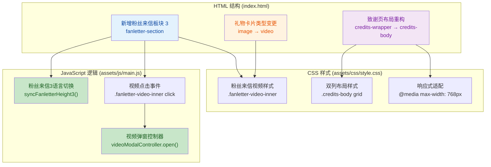
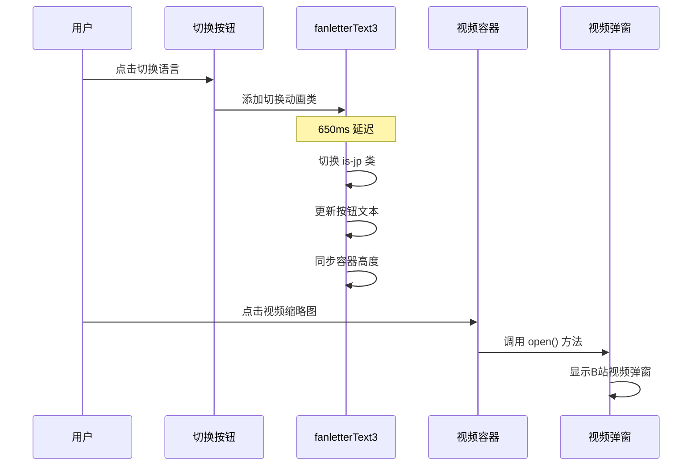

## 📋 高级摘要 (TL;DR)

*   **影响范围:** 中等 - 新增粉丝来信视频功能，重构致谢页面布局
*   **主要变更:**
    *   ✨ 新增第三个粉丝来信板块，支持中日文切换和视频展示
    *   🎬 将礼物卡片从静态图片改为可播放的B站视频
    *   📐 致谢页面从单列布局重构为双列响应式布局（左文右图）
    *   📱 完善移动端适配，确保各屏幕尺寸下的良好体验

---

## 🗺️ 可视化概览 (代码与逻辑映射)



---

## 📝 详细变更分析

### 🎨 组件 1: 粉丝来信板块 3 (新增)

**变更说明:** 在 `index.html` 中新增了第三个粉丝来信板块，采用"左文右图"布局，支持中日文双语切换和视频展示。

**关键特性:**
- **双语切换:** 默认显示日文，点击按钮切换至中文，带平滑过渡动画
- **视频展示:** 右侧展示B站视频缩略图，点击可打开视频弹窗
- **响应式设计:** 移动端自动调整为垂直布局

**HTML 结构:**
```html
<div class="fanletter-section">
  <div class="fanletter-text is-jp" id="fanletterText3">
    <!-- 中日文内容 -->
  </div>
  <div class="fanletter-video">
    <!-- 视频缩略图 -->
  </div>
</div>
```

**JavaScript 逻辑 (Source: `assets/js/main.js`):**
| 函数/变量 | 功能描述 |
|-----------|---------|
| `syncFanletterHeight3()` | 同步文本容器高度，实现平滑过渡 |
| `fanletterSwitch3.addEventListener()` | 处理语言切换点击事件 |
| `isFanletterJp3` | 当前语言状态标志 |

---

### 🎬 组件 2: 礼物卡片类型变更

**变更说明:** 将礼物卡片从静态图片类型改为视频类型，支持B站视频播放。

**数据变更表:**

| 属性 | 旧值 | 新值 | 说明 |
|------|------|------|------|
| `data-type` | `image` | `video` | 卡片类型标识 |
| `data-url` | `./assets/images/gift_tutu.webp` | `https://www.bilibili.com/video/BV1NnEt6MEX4` | 视频链接 |
| `data-title` | `更新失敗の書道` | `【预留标题】` | 视频标题 |
| `data-desc` | `お誕生日の佳き日に...` | `预留描述` | 视频描述 |
| `src` | `gift_tutu.webp` | `gift_mc.webp` | 缩略图资源 |
| 标签 | `CALLIGRAPHY` | `VIDEO` | 卡片标签 |

**新增元素:**
- 视频播放遮罩层 (`.video-play-overlay`)
- 播放按钮图标 (`.play-circle`)

---

### 📐 组件 3: 致谢页面布局重构

**变更说明:** 将致谢页面从单列垂直布局重构为双列网格布局，提升视觉层次感。

**布局结构对比:**

| 布局类型 | 旧结构 | 新结构 |
|---------|--------|--------|
| 容器 | `.credits-wrapper` | `.credits-body` |
| 左侧内容 | 无独立容器 | `.credits-left` (文字内容) |
| 右侧内容 | 无独立容器 | `.credits-right` (图片展示) |
| 布局方式 | 垂直堆叠 | Grid 布局 (1fr 340px) |

**CSS 样式 (Source: `assets/css/style.css`):**
```css
.credits-body {
  display: grid;
  grid-template-columns: 1fr 340px;  /* 左侧自适应，右侧固定340px */
  gap: 48px;
  align-items: center;
}
```

**响应式适配:**
```css
@media (max-width: 768px) {
  .credits-body {
    grid-template-columns: 1fr;  /* 移动端单列 */
    gap: 32px;
  }
  .credits-right {
    order: -1;  /* 图片在移动端显示在上方 */
  }
}
```

---

### 🎨 组件 4: 粉丝来信视频样式 (新增)

**变更说明:** 为粉丝来信视频添加完整的交互样式和动画效果。

**样式特性表:**

| 样式类 | 功能 | 关键属性 |
|--------|------|---------|
| `.fanletter-video-inner` | 视频容器 | 16:9 比例，圆角 12px |
| `.video-play-overlay` | 播放遮罩 | 半透明黑色背景 (0.08) |
| Hover 效果 | 悬停交互 | 缩放 1.02x，阴影增强 |
| 过渡动画 | 平滑效果 | `transition: 0.3s ease` |

**兼容性处理:**
```css
@supports (aspect-ratio: 1) {
  .fanletter-video-inner {
    height: auto;
    padding-bottom: 0;  /* 现代浏览器使用 aspect-ratio */
  }
}
```

---

### ⚡ 组件 5: JavaScript 交互逻辑

**变更说明:** 新增粉丝来信3的语言切换和视频点击事件处理。

**事件处理流程:**



**新增代码块:**
- **语言切换:** `fanletterSwitch3.addEventListener()` (行 2034-2054)
- **视频点击:** `.fanletter-video-inner.forEach()` (行 2084-2094)

---

## ⚠️ 影响与风险评估

### 🔴 破坏性变更
无破坏性变更，所有修改为新增或重构，不影响现有功能。

### 🟡 潜在风险
| 风险项 | 风险等级 | 缓解措施 |
|--------|---------|---------|
| 视频链接失效 | 低 | 建议添加视频加载失败处理 |
| 移动端布局错乱 | 低 | 已添加响应式断点，需多设备测试 |
| 高度同步计算误差 | 低 | 使用 `scrollHeight` 动态计算，兼容性好 |

### ✅ 测试建议
1. **功能测试:**
   - 验证粉丝来信3的中日文切换动画流畅性
   - 测试视频点击是否能正确打开B站弹窗
   - 检查礼物卡片视频播放功能

2. **布局测试:**
   - 桌面端 (1920x1080): 验证双列布局正常
   - 平板端 (768px): 验证临界点布局切换
   - 移动端 (375x667): 验证垂直堆叠顺序

3. **兼容性测试:**
   - 测试 `aspect-ratio` 不支持的旧浏览器
   - 验证视频加载性能和懒加载效果

---

## 📊 变更统计

| 文件 | 新增行数 | 删除行数 | 净变更 |
|------|---------|---------|--------|
| `index.html` | +58 | -8 | +50 |
| `assets/css/style.css` | +75 | -2 | +73 |
| `assets/js/main.js` | +48 | -1 | +47 |
| **总计** | **+181** | **-11** | **+170** |