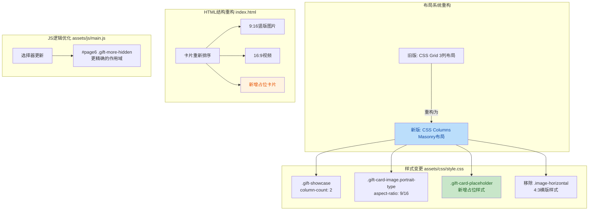

## 1. 高层摘要 (TL;DR)

*   **影响范围：** 🟡 **中等** - 重构了礼物展示区的布局系统，从固定三列网格改为响应式Masonry瀑布流
*   **核心变更：**
    *   ✨ 将CSS Grid三列布局改为CSS Columns Masonry布局
    *   📐 调整图片比例：从 3:4 改为 9:16（竖版），移除 4:3 横版样式
    *   🎨 新增占位卡片样式（虚线边框、半透明效果）
    *   📱 优化移动端"查看更多"按钮的选择器逻辑
    *   📝 更新视频播放量数据（10.7万 → 19.2万）

---

## 2. 可视化概览 (逻辑架构图)



---

## 3. 详细变更分析

### 🎨 样式层变更 (`assets/css/style.css`)

#### 布局系统重构

| 属性 | 旧值 | 新值 | 说明 |
|------|------|------|------|
| `.gift-showcase` 布局 | `display: grid`<br/>`grid-template-columns: 1fr 1fr 1fr` | `column-count: 2`<br/>`column-gap: 20px` | 从三列网格改为双列Masonry |
| `.gift-showcase` 宽度 | - | `max-width: 760px`<br/>`margin: 0 auto 12px` | 限制最大宽度并居中 |
| 卡片间距 | `gap: 20px` | `margin-bottom: 20px`<br/>`break-inside: avoid` | Masonry布局下使用margin |

#### 图片比例调整

| 类名 | 旧比例 | 新比例 | 变更类型 |
|------|--------|--------|----------|
| `.image-type` → `.portrait-type` | 3:4 (75%) | 9:16 (177.78%) | 竖版图片更修长 |
| `.image-horizontal` | 4:3 | ❌ 已移除 | 横版样式删除 |
| `.video-type` | 16:9 | 16:9 | 保持不变 |

#### 新增占位卡片样式

```css
.gift-card-placeholder {
  cursor: default;
  opacity: 0.35;
  /* 虚线边框 + 半透明背景 */
}
.gift-card-placeholder:hover {
  transform: none; /* 禁用悬停倾斜效果 */
}
```

#### 移动端响应式调整

| 元素 | 旧样式 | 新样式 |
|------|--------|--------|
| `.gift-showcase` | `grid-template-columns: 1fr` | `column-count: 1` |
| `.gift-more-hidden` | `display: block` | `display: none` |
| `.gift-load-more` | `display: none` | `display: block` + 悬停效果 |

---

### 📄 HTML结构重构 (`index.html`)

#### 卡片布局重组

**旧版结构（3列固定）：**
```
列1-上: 3:4图片  |  列2-上: 3:4图片  |  列3-上: 3:4图片
列1-下: 4:3视频  |  列2-下: 4:3图片  |  列3-下: 4:3视频
```

**新版结构（Masonry流式）：**
```
9:16图片 → 16:9视频 → 16:9视频 → 9:16图片 → 16:9图片 → 占位卡片
```

#### 内容更新

| 项目 | 旧值 | 新值 |
|------|------|------|
| 视频播放量 | 10.7万 | 19.2万 |
| 视频描述 | "猫粥史上最高播放量" | "猫粥切片史上最高播放量" |
| 预留视频标题 | "【预留视频】" | "【偶像大师/MMD】猫羽おかゆの恋のSOS" |
| 书道标签 | - | CALLIGRAPHY |

#### 新增元素

```html
<!-- 占位卡片 -->
<div class="gift-card gift-card-placeholder gift-more-hidden">
  <div class="gift-card-image video-type">
    <div class="placeholder-content">
      <span class="placeholder-icon">+</span>
      <span class="placeholder-text">预留位置</span>
    </div>
  </div>
</div>
```

---

### ⚡ JavaScript逻辑优化 (`assets/js/main.js`)

#### 选择器精确化

| 旧选择器 | 新选择器 | 优势 |
|----------|----------|------|
| `.gift-card.gift-more-hidden` | `#page6 .gift-more-hidden` | 限定作用域，避免意外匹配 |

```javascript
// 旧版
const hiddenGifts = document.querySelectorAll('.gift-card.gift-more-hidden');

// 新版
const hiddenGifts = document.querySelectorAll('#page6 .gift-more-hidden');
```

#### 注释更新
- "礼物卡片" → "特殊赠礼"
- 新增初始状态说明注释

---

## 4. 影响与风险评估

### ⚠️ 潜在风险

| 风险项 | 严重性 | 说明 | 建议 |
|--------|--------|------|------|
| Masonry布局兼容性 | 🟡 中等 | CSS Columns在旧版浏览器支持有限 | 验证目标浏览器兼容性 |
| 卡片顺序变化 | 🟢 低 | 视觉顺序改变，但内容未丢失 | 确认展示顺序符合预期 |
| 图片比例调整 | 🟡 中等 | 3:4 → 9:16 可能导致图片裁剪 | 检查所有竖版图片的显示效果 |

### ✅ 测试建议

1. **布局测试**
   - [ ] 验证PC端双列Masonry布局是否正常
   - [ ] 验证移动端单列布局是否正常
   - [ ] 测试不同屏幕尺寸下的卡片排列

2. **交互测试**
   - [ ] 测试"查看更多"按钮在移动端的展开/收起功能
   - [ ] 验证占位卡片无悬停倾斜效果
   - [ ] 测试卡片点击跳转功能

3. **视觉测试**
   - [ ] 检查9:16图片是否正确显示
   - [ ] 验证占位卡片的虚线边框和透明度
   - [ ] 确认视频播放量更新正确

4. **兼容性测试**
   - [ ] Chrome/Edge/Safari/Firefox 最新版
   - [ ] iOS Safari 15+
   - [ ] Android Chrome

---

## 5. 总结

本次重构将礼物展示区从**固定三列网格布局**升级为**响应式Masonry瀑布流布局**，主要优势：

- ✅ **更灵活的卡片排列**：不同比例的卡片可以自然堆叠
- ✅ **更好的视觉流动性**：竖版9:16比例更适合现代移动端浏览
- ✅ **预留扩展空间**：新增占位卡片便于未来添加内容
- ✅ **更精确的选择器**：JS选择器限定作用域，避免潜在冲突

**建议优先测试移动端体验**，因为Masonry布局在小屏幕上的表现是本次优化的重点。