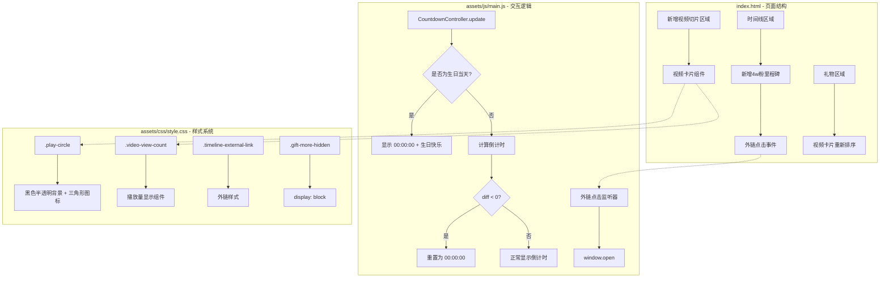

## 📋 高级摘要（TL;DR）

- **影响范围**：中等 - 主要是UI样式优化、倒计时逻辑修复和内容更新
- **核心变更**：
  - ✨ 新增"猫的切片"视频展示区域
  - 🎂 优化生日倒计时逻辑，修复负数时间显示问题
  - 🎨 重构播放按钮样式（从文字"PLAY"改为三角形图标）
  - 📝 更新时间线内容，新增4w粉里程碑
  - 🔗 新增时间线外链点击功能

---

## 🗺️ 视觉概览（代码与逻辑图）



---

## 🔍 详细变更分析

### 🎨 **样式层（assets/css/style.css）**

#### 新增样式组件

| 样式类名 | 用途 | 关键属性 |
|---------|------|---------|
| `.timeline-external-link` | 时间线外链样式 | 粉色虚线下划线，hover效果 |
| `.video-view-count` | 视频播放量显示 | 左下角黑色半透明背景，圆角 |

#### 播放按钮重构

```css
/* 旧样式：白色背景 + "PLAY" 文字 */
.play-circle {
  width: 46px;
  height: 46px;
  background: rgba(255,255,255,0.9);
  font-size: 11px;
  color: #d4708a;
  content: "PLAY";  /* 文字内容 */
}

/* 新样式：黑色半透明背景 + 三角形图标 */
.play-circle {
  width: 56px;
  height: 56px;
  background: rgba(0,0,0,0.5);
  font-size: 24px;
  color: #fff;
}
.play-circle::before {
  content: '\25B6';  /* Unicode 播放符号 ▶ */
  margin-left: 4px;
}
```

#### 礼物显示逻辑调整

| 样式类 | 旧值 | 新值 | 说明 |
|--------|------|------|------|
| `.gift-more-hidden` | `display: none` | `display: block` | 隐藏内容改为默认显示 |
| `.gift-load-more` | `display: block` | `display: none` | 加载按钮改为隐藏 |

---

### ⚙️ **逻辑层（assets/js/main.js）**

#### 倒计时控制器重构

**变更前逻辑：**
```javascript
update() {
  const now = new Date();
  const targetDate = this.getNextTargetDate();
  const diff = targetDate - now;
  // 计算时间...
  // 然后检查是否为生日
  const isBirthday = now.getMonth() === this.targetMonth && now.getDate() === this.targetDay;
  if (isBirthday) {
    this.elements.caption.innerHTML = '<span class="date">生日快乐！</span>';
  }
}
```

**变更后逻辑：**
```javascript
update() {
  const now = new Date();
  
  // 1. 优先检查生日
  const isBirthday = now.getMonth() === this.targetMonth && now.getDate() === this.targetDay;
  if (isBirthday) {
    this.elements.days.textContent = '00';
    this.elements.hours.textContent = '00';
    this.elements.mins.textContent = '00';
    this.elements.secs.textContent = '00';
    this.elements.caption.innerHTML = '<span class="date">生日快乐！</span>';
    return;  // 提前返回
  }

  // 2. 计算倒计时
  const targetDate = this.getNextTargetDate();
  const diff = targetDate - now;

  // 3. 防护：diff为负数时重置
  if (diff < 0) {
    console.warn('CountdownController: diff为负数，已重置');
    this.elements.days.textContent = '00';
    this.elements.hours.textContent = '00';
    this.elements.mins.textContent = '00';
    this.elements.secs.textContent = '00';
    this.elements.caption.innerHTML = `距离<span class="date">${this.targetLabel}</span>还有`;
    return;
  }

  // 4. 正常计算和显示
  // ...
}
```

**改进点：**
- ✅ 生日检测提前，避免不必要的计算
- ✅ 添加负数diff防护，防止显示负数时间
- ✅ 生日当天强制显示"00:00:00"

#### 新增外链点击监听器

```javascript
// Page3 时间线中外链链接（如动态帖子等）
document.querySelectorAll('.timeline-external-link').forEach(link => {
  link.addEventListener('click', (e) => {
    e.preventDefault();
    e.stopPropagation();
    const url = link.dataset.url;
    const target = link.dataset.target || '_blank';
    if (url) {
      window.open(url, target);
    }
  });
});
```

---

### 📄 **内容层（index.html）**

#### 时间线内容更新

| 日期 | 旧标题 | 新标题 | 变更说明 |
|------|--------|--------|----------|
| 2026.05.31 | "首次超晚学汉语直播回" | "深夜学汉语直播回" | 标题简化 |
| - | - | 2026.6.5 "4w粉啦！" | **新增里程碑** |

**新增4w粉里程碑：**
```html
<div class="timeline-item">
  <p class="timeline-date">2026.6.5</p>
  <p class="timeline-title">4w粉啦！</p>
  <p class="timeline-desc">
    在下午1:51的时刻，猫羽おかゆ4w粉成就达成！
    <span class="timeline-external-link" 
          data-url="https://www.bilibili.com/opus/1210436665851510787" 
          data-target="_blank">(இωஇ`｡)</span>
  </p>
</div>
```

#### 新增"猫的切片"视频区域

```html
<div class="video-section">
  <div class="section-header">
    <h3 class="section-title">猫的切片 · Highlights</h3>
    <p class="section-desc">精彩直播片段回顾</p>
  </div>
  <div class="video-grid">
    <!-- 视频卡片1：带播放量显示 -->
    <div class="video-card" data-title="日本萝莉猫猫直播中习惯性摆出雷霆宅女坐姿" 
         data-url="https://www.bilibili.com/video/BV1seEw6YEmL" 
         data-bvid="BV1seEw6YEmL">
      <div class="video-thumbnail">
        <div class="video-view-count">10.7万</div>  <!-- 新增播放量 -->
        
        <div class="video-duration">00:42</div>
      </div>
      <!-- ... -->
    </div>
    <!-- 视频卡片2、3占位 -->
  </div>
</div>
```

#### 礼物区域视频卡片重新排序

| 位置 | 旧内容 | 新内容 |
|------|--------|--------|
| 列1-下 | 【猫羽おかゆ】自制MV《快乐星猫》 | 【预留视频】（空白の音符） |
| 列3-下 | 【预留】 | 【猫羽おかゆ】自制MV《快乐星猫》（かくさん潇潇落叶） |

#### 移除内容
- 删除底部的"bilibili介绍朋友"直达链接区域

---

### 📊 **数据层（assets/js/danmaku-data.js）**

弹幕顺序调整：

| 顺序 | 旧位置 | 新位置 | 弹幕作者 |
|------|--------|--------|----------|
| 4 | 【空白の音符】 | - | 移至第2位 |
| 5 | 【北斗肥龙】 | - | 移至第4位 |

---

## ⚠️ 影响与风险评估

### 🔴 **破坏性变更**
无

### 🟡 **潜在风险**
| 风险项 | 描述 | 缓解措施 |
|--------|------|----------|
| 礼物显示逻辑反转 | `.gift-more-hidden` 和 `.gift-load-more` 的显示逻辑互换 | 需确认是否为预期行为（可能隐藏了"加载更多"按钮） |
| 视频卡片占位 | 新增的视频卡片2、3为占位内容 | 需后续填充实际内容 |

### ✅ **测试建议**
1. **倒计时功能测试**：
   - 验证生日当天（6月8日）显示"00:00:00"和"生日快乐！"
   - 验证非生日日期正常倒计时
   - 验证时区边缘情况（diff接近0时）

2. **交互功能测试**：
   - 点击时间线中的"(இωஇ`｡)"外链，确认能正确打开B站动态
   - 点击视频卡片，确认跳转正确

3. **UI样式测试**：
   - 检查播放按钮hover效果（背景变深、放大）
   - 检查视频播放量显示位置和样式
   - 检查时间线外链hover效果

4. **内容完整性测试**：
   - 确认礼物区域视频卡片显示正确
   - 确认新增的"猫的切片"区域正常渲染

---

## 📌 总结

本次更新主要围绕**生日页面的UI优化和功能增强**：
- 🎯 核心改进：倒计时逻辑更健壮，修复了负数时间显示bug
- 🎨 视觉升级：播放按钮更现代化，新增视频播放量显示
- 📝 内容丰富：新增4w粉里程碑和"猫的切片"视频区域
- 🔗 交互增强：支持时间线外链点击跳转

整体改动为**中等风险**，建议重点测试倒计时逻辑和礼物显示逻辑。