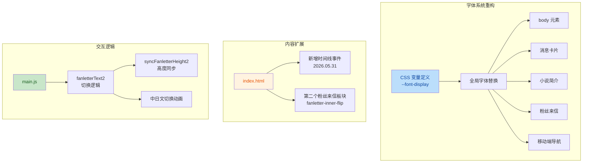

## 1. 高层摘要（TL;DR）

*   **影响范围**：🟡 **中等** - 重构全局字体系统并新增内容板块
*   **核心变更**：
    *   🎨 将 **Noto Sans JP** 替换为 **Klee One** 作为中日文回退字体
    *   📝 引入 CSS 变量统一管理字体声明
    *   📬 新增第二个粉丝来信板块（图左文右布局）
    *   📅 添加新的时间线事件（2026.05.31）
    *   ✨ 优化文本渲染质量和响应式布局

---

## 2. 可视化概览（代码与逻辑映射）



---

## 3. 详细变更分析

### 🎨 组件一：字体系统重构

#### **变更说明**
将项目中所有硬编码的字体声明统一迁移到 CSS 变量 `--font-display`，并替换字体资源。

#### **字体资源变更表**

| 字体名称 | 原用途 | 新用途 | 来源 |
|---------|--------|--------|------|
| **LXGW WenKai** | 中文正文（优先） | 中日正文（优先） | jsDelivr CDN |
| **Klee One** | - | 中日正文（回退） | Google Fonts |
| ~~Noto Sans JP~~ | 日文正文（回退） | 已移除 | Google Fonts |

#### **关键代码变更**（来源：`assets/css/style.css`）

```css
/* 字体导入替换 */
-@import url('https://fonts.googleapis.com/css2?family=Noto+Sans+JP:wght@300;400;500;700;900&display=swap');
+@import url('https://fonts.googleapis.com/css2?family=Klee+One:wght@400;600&display=swap');

/* CSS 变量定义 */
:root {
+  --font-display: 'LXGW WenKai', 'Klee One', serif;
  --accent: #d4708a;
  /* ... */
}

/* 全局应用 */
body {
-  font-family: 'LXGW WenKai', 'Noto Sans JP', sans-serif;
+  font-family: var(--font-display);
}
```

#### **文本渲染优化**
新增以下属性提升字体显示质量：
```css
.message-card {
  /* 移除 perspective，避免影响文本渲染 */
  perspective: none;
  /* 优化文本渲染质量 */
  text-rendering: optimizeLegibility;
  -webkit-font-smoothing: antialiased;
  -moz-osx-font-smoothing: grayscale;
}

.message-card-front {
  /* 使用 3D 加速提升渲染质量 */
  transform: translateZ(0);
  backface-visibility: hidden;
}
```

---

### 📬 组件二：粉丝来信扩展

#### **变更说明**
新增第二个粉丝来信板块，采用图左文右的镜像布局（`fanletter-inner-flip`），并实现独立的中日文切换功能。

#### **布局对比表**

| 属性 | 原布局（来信1） | 新布局（来信2） |
|------|----------------|----------------|
| **Grid 列宽** | `1fr 1fr` | `300px 1fr` |
| **最大宽度** | `900px` | `960px` |
| **图片位置** | 右侧 | 左侧 |
| **类名** | `fanletter-inner` | `fanletter-inner-flip` |

#### **新增 JavaScript 逻辑**（来源：`assets/js/main.js`）

```javascript
// 第二个粉丝来信切换逻辑
const fanletterText2 = document.getElementById('fanletterText2');
const fanletterSwitch2 = document.getElementById('fanletterSwitch2');
// ... 初始化状态

const syncFanletterHeight2 = () => {
  const activeEl = isFanletterJp2 ? fanletterJP2 : fanletterCN2;
  // 动态同步高度
  fanletterContent2.style.height = activeEl.scrollHeight + 'px';
};

fanletterSwitch2.addEventListener('click', () => {
  // 650ms 切换动画
  isFanletterJp2 = !isFanletterJp2;
  fanletterSwitch2.textContent = isFanletterJp2 ? '点击切换中文 ▸' : '日本語で読む ▸';
});
```

#### **HTML 结构**（来源：`index.html`）
```html
<!-- 新增第二个粉丝来信板块 -->
<div class="fanletter-section">
  <div class="fanletter-inner fanletter-inner-flip">
    <div class="fanletter-image">
      
    </div>
    <div class="fanletter-text is-jp" id="fanletterText2">
      <!-- 中日文内容 -->
    </div>
  </div>
</div>
```

---

### 📅 组件三：时间线与标题更新

#### **变更说明**
添加新的时间线事件，并简化页面标题。

#### **时间线新增事件**

| 日期 | 标题 | 描述 |
|------|------|------|
| **2026.05.31** | 首次超晚学汉语直播回 | 这天真的好兴奋，又学中文又弹吉他，直到第二天凌晨一点（日本时间）才不舍的下播 |

#### **标题变更**
```html
<!-- 旧标题 -->
-<title>猫羽おかゆ お誕生日</title>

<!-- 新标题 -->
+<title>猫羽おかゆ</title>
```

---

### 📱 组件四：响应式与样式优化

#### **小说简介样式拆分**
```css
/* 原样式 */
.novel-synopsis p { ... }

/* 拆分为中日文独立样式 */
+.novel-synopsis-cn p { font-family: var(--font-display); }
+.novel-synopsis-jp p { font-family: var(--font-display); }
```

#### **粉丝来信样式优化**
```css
/* 新增 overflow 防止内容溢出 */
.novel-synopsis-inner { overflow: hidden; }
.fanletter-text-content { overflow: hidden; }

/* 切换按钮层级提升 */
.novel-synopsis-hint { position: relative; z-index: 1; }
.fanletter-switch { position: relative; z-index: 1; }
```

#### **移动端适配**
```css
@media (max-width: 768px) {
  .fanletter-inner,
  .fanletter-inner-flip {
    grid-template-columns: 1fr;
    max-width: 100%;
  }
  
  .fanletter-image-inner {
    margin: 0 auto;
  }
  
  .fanletter-signature {
    text-align: center;
  }
}
```

---

## 4. 影响与风险评估

### ⚠️ 潜在风险

| 风险项 | 严重程度 | 说明 |
|--------|----------|------|
| **字体加载失败** | 🟡 中等 | 如果 `Klee One` CDN 加载失败，将回退到系统 serif 字体 |
| **高度同步异常** | 🟢 低 | `syncFanletterHeight2()` 依赖 DOM 元素存在，若元素缺失会静默失败 |
| **移动端布局** | 🟢 低 | 新增的 `fanletter-inner-flip` 已包含响应式样式 |

### ✅ 测试建议

1.  **字体渲染测试**
    *   验证中日文混合文本显示正常
    *   检查字体加载失败时的回退表现
    *   测试旋转卡片（`.message-card`）的文本清晰度

2.  **粉丝来信功能测试**
    *   测试第二个来信的中日文切换动画（650ms）
    *   验证高度同步在长文本下的表现
    *   检查移动端布局（图片居中、签名对齐）

3.  **响应式测试**
    *   在 768px 断点下验证两个来信板块的布局
    *   测试时间线工具提示的显示

---

## 5. 总结

本次变更主要围绕**字体系统现代化**和**内容扩展**展开：
- ✅ 通过 CSS 变量实现字体统一管理，提升可维护性
- ✅ 新增 `Klee One` 字体，优化中日文显示效果
- ✅ 扩展粉丝来信功能，支持镜像布局和独立切换
- ✅ 优化文本渲染质量，改善用户体验

**建议**：在部署前进行跨浏览器字体加载测试，确保 CDN 稳定性。